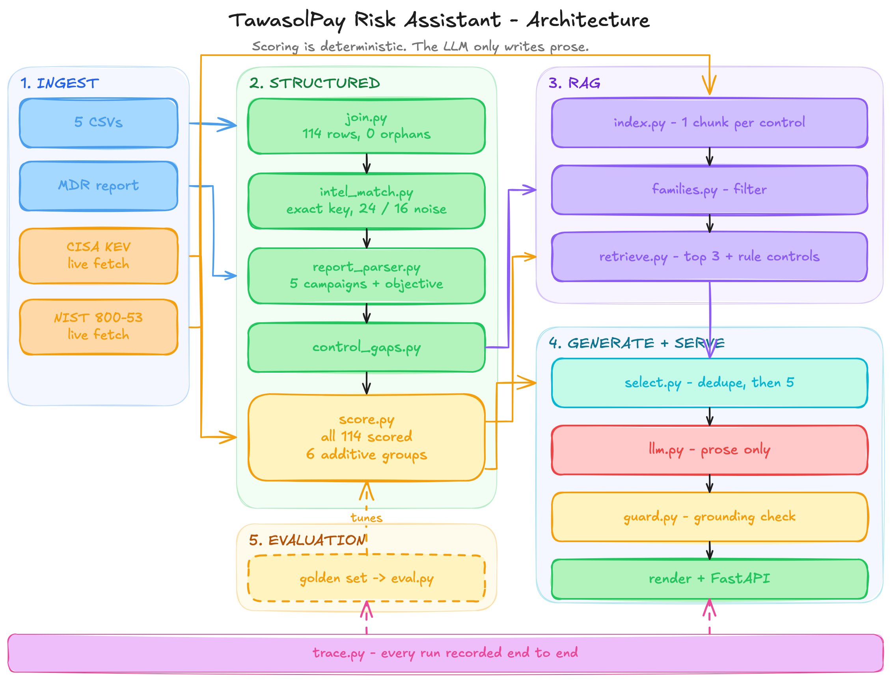

# TawasolPay Cyber Risk Assistant

Ranks TawasolPay's 114 open vulnerability findings into a defensible top-5 risk brief and
cites the NIST SP 800-53 control that applies to each. Every number in the brief traces
back to the exact input bytes it came from. The ranking is deterministic — a weighted rule
set decides order, score, and control; the LLM only writes the one prose sentence that
explains a rank, and it can invent nothing the guard cannot find in the evidence.

**[Live brief](https://tawasolpay-risk.onrender.com/) · [API](https://tawasolpay-risk.onrender.com/api/risks)**

The single most important design fact: **the LLM never decides a rank, a score, or which
control applies.** Those are computed before it is called. If the model is unreachable, the
brief still renders — only the prose degrades to a template.

## 1. How it works

The CSVs load into typed Pydantic models and join on their keys (`asset_id`,
`business_service`, `matched_cve_or_control`). Threat intel attaches to a finding by **exact
string equality** on `matched_cve_or_control` — no fuzzy match, no embeddings. The MDR
advisory is parsed separately and cross-checked against the intel CSV without merging.
CISA KEV is fetched live and sets a three-valued `kev_status` per finding. All 114 findings
are then scored by the deterministic weighted rule set in `config.WEIGHTS`, which produces a
per-group breakdown (exposure, exploitability, adversary, business, control_gap,
blast_radius) that sums to a total. The scored set is deduped (identical CVE on paired hosts
collapses to one entry) and the top 5 are selected. Only then, for those 5, does the system
retrieve NIST controls from a Chroma vector store (over-fetch 40, collapse control
enhancements to their base, keep 3 distinct base controls) and call the Groq LLM five times
to write each explanation sentence. A grounding guard validates every sentence against an
evidence allow-list; a violation is retried once, then falls to a template. The result is a
`RiskBrief` served as an HTML report plus four JSON routes, with one JSONL trace appended
per run.

```
data/*.csv (assets, vulnerabilities, threat_intel,          data/synthetic_threat_report.md
           business_services, remediation_guidance)          (MDR advisory)
       │  STRUCTURED: join keys · closed enums · magnitudes         │
       ▼                                                            ▼
  join ─► intel_match ─► control_gaps ─► campaign objectives ◄── report_parser (cross-check, no merge)
       │   (EXACT string equality on matched_cve_or_control)
       ▼
  score ALL 114 findings (deterministic; config.WEIGHTS)    CISA KEV ──live fetch──► kev_status
       │                                                    (listed / not_listed / unknown), rescore
       ▼
  dedupe ─► select top-5
       │
       ├──────────► retrieve NIST controls ◄── Chroma (NIST CONTROLS ONLY)
       │   SEMANTIC: over-fetch 40 ─► collapse enhancements to base ─► top-3 distinct
       ▼
  guard ─► Groq LLM writes PROSE ONLY ─► explanation_source: llm | template
       │   (rank, evidence, control already decided; a refusal degrades prose, not the ranking)
       ▼
  RiskBrief ─► HTML report · /api/risks · /api/findings (all 114) · /healthz · /traces

  ── BUILD TIME (docker build, embedding model present) ──────────────────────────
  NIST catalog ──live fetch──► all-MiniLM-L6-v2 ──► Chroma index (1189 controls)
                                                  + per-finding query-vector pack
```



*All 114 findings are scored and the top-5 controls retrieved **before** any LLM call. The
five LLM calls happen at the very end, on output whose rank, score, evidence, and control
are already fixed. The diagram is not a streaming pipeline — the model writes captions for a
decision that is already made.*

## 2. Sample output

The real rendered brief for risk #1, copied from `render_markdown` on a live run (the prose
sentence is LLM-written and varies run to run; the rank, evidence, and control are
deterministic):

```markdown
## #1 — Citrix ADC Session Token Leak (CitrixBleed)

- **Assets:** load-balancer-prod-01, load-balancer-prod-02 · **Service:** Customer Login (Chief Digital Officer, RTO 1h)
- _highest-severity instance shown; affects 2 assets across Production._
- **Evidence:** CVE-2023-4966 · CVSS 9.4 · internet-facing · exploit available · no auth required · 180 days open · EDR absent
- **Threat:** IronVeil "CitrixBleed Exploitation" — ransomware, High confidence, Global
- **Control:** SI-4 Device Identification and Authentication, particularly IA-3(2), IA-3(1) — The system must monitor for attacks and unauthorized connections, analyze detected events, and adjust monitoring activity based on changes in risk to organizational operations.
- **Also applies:** SI-3 Malicious Code Protection — no EDR installed on this host
- **Also applies:** SI-4 System Monitoring — no EDR installed on this host
- **Why this ranks #1:** This finding holds rank 1 because the internet-facing production load balancers are vulnerable to an unauthenticated exploit with a CVSS of 9.4 that is actively being exploited by the IronVeil actor in a ransomware campaign. The absence of EDR agents and the criticality of the customer-facing login service with a 1-hour RTO further elevate the risk score to 106.52.
```

The full top-5 (live, KEV applied):

| # | CVE | Finding | Asset | Service | Score |
|---|-----|---------|-------|---------|------:|
| 1 | CVE-2023-4966 | Citrix ADC Session Token Leak (CitrixBleed) | load-balancer-prod-01/02 | Customer Login | 106.52 |
| 2 | CVE-SYN-2026-0010 | Payment API Insecure Direct Object Reference | payment-api-prod-01 | Payment Processing | 97.28 |
| 3 | CVE-SYN-2026-0011 | Kong Gateway Admin API Exposed | partner-api-gateway-prod | Partner API Gateway | 96.44 |
| 4 | CLOUD-SYN-001 | Storage Bucket Public Policy Misconfiguration | backup-storage-prod | Backup and Recovery | 95.28 |
| 5 | CVE-SYN-2026-0001 | Remote Code Execution in Web Framework | auth-gateway-prod-01 | Customer Login | 92.84 |

**Requirement mapping.** The assignment asks each risk to surface the asset, the
vulnerability, matched threat intelligence, the business service, and a plain-English
explanation. In the brief above: **asset** is the `Assets:` line (`affected_assets`);
**vulnerability** is the heading plus the `Evidence:` line (CVE, CVSS, exposure, exploit,
auth, days-open, EDR); **matched threat intelligence** is the `Threat:` line
(`threat_summary`, built only from intel that matched by exact key); **business service** is
the `Service:` field with owner and RTO; the **plain-English explanation** is the `Why this
ranks #N:` sentence (`why_ranked`), grounded LLM prose or a template.

## 3. The data split (supporting question 1)

**Structured** is everything with a join key, a closed enum, or a meaningful magnitude: the
asset inventory (60 rows), the vulnerability rows (114), the intel feed (40), the service map
(20), the remediation guidance (30). Every query against these is a filter or a join —
`asset_id → asset`, `matched_cve_or_control → intel`, `business_service → service`. I never
embed any of it, because embedding destroys ordering: a CVSS of 9.8 versus 4.3 is a rank, and
cosine distance over an embedded "9.8" throws that rank away. So these load into typed models
and the embedder never touches them.

**Embedded** is the NIST SP 800-53 catalog and nothing else — 1189 control statements. A
control statement is unbounded prose with no join key, and the link from a finding to its
control is semantic: "unpatched internet-facing service" *is* SI-2 / SC-7 even though those
strings never co-occur. That is what an embedding model is for and what a filter cannot do.
This is the whole contents of the vector store.

**The ambiguous cases, and how I resolved them:**

- **`remediation_guidance.csv`** reads like prose and has no clean join key. I treated it as
  **structured** — a lookup resolved with hand-verified keyword rules, not a corpus. With only
  30 rows I could check the keyword mapping exhaustively by hand, which is more auditable than
  a fuzzy match. Embedding it would have put non-NIST content in the vector store for no
  retrieval benefit.
- **`threat_intelligence.summary`** is free text and tempting to embed. I kept it
  **structured and displayed, not queried**: the intel-to-finding link is the exact
  `matched_cve_or_control` key. The summary is shown as evidence and passed to the LLM as
  context, but it is never a retrieval key — that would reintroduce the fuzzy matching the
  dataset is built to punish (see §8, failure mode 1).
- **The MDR report** (`synthetic_threat_report.md`) is two documents in one file. Five
  campaign blocks are structured records wearing prose clothing (target profile, exploit
  chain, ransomware yes/no, confidence) — parsed by `report_parser` and cross-checked against
  the intel CSV. The "Threat Intelligence Analyst Notes" section is not data at all: it is the
  scoring rubric. I encoded it as weights (see §4) rather than parsing it.

## 4. Scoring — how the weights were set

The weights are **ordinal, not empirical.** They encode a stated priority order; they are not
measured coefficients fit to an answer. They live in `src/riskagent/config.py::WEIGHTS` as a
plain nested dict so `eval.py` can sweep them.

**Provenance.** The MDR report's "Threat Intelligence Analyst Notes" lists five factors *in
priority order* (`data/synthetic_threat_report.md`, lines 79–83). Those five became the five
scoring groups. The source comment carrying this mapping is the module docstring at the top of
`config.py` (it cites each factor and its line number).

| # | Factor (report rubric, lines 79–83) | Group | Group max | Key terms |
|---|---|---|---:|---|
| 1 | Internet exposure | `exposure` | 25 | internet_exposed 18, production 7 |
| 2 | Active exploitation in the wild | `exploitability` | 22 | cvss×8, exploit_available 8, no_auth 4, kev_listed 2 (+ maturity ≤5) |
| 3 | Ransomware association | `adversary` | 25 | intel_match 8, ransomware 8, region/sector fit 2, recent 2 (+ maturity) |
| 4 | Business criticality / compliance scope | `business` | 25 | customer_facing 4, PCI/GDPR 4, revenue 4, RTO tiered 5/3/1 (+ criticality) |
| 5 | Missing compensating controls | `control_gap` | 10 | no_edr 5, no_vendor_patch 3, days_open 2 |

**Weights that came from measurement, not from the report.** Three signals were not in the
rubric. They were surfaced by hand-ranking findings and by the golden set (§5), and each is
tied to a specific constraint or annotation:

- **`transitive_dependents` (blast_radius group).** The golden set showed the scorer modelled
  *likelihood* well and *consequence* barely. Forward dependency fan-out was added as its own
  group so the five report-derived group maxima stay stable. Points: `dependents_high` 6
  (≥3 dependents), `dependents_low` 3.
- **`recovery_infrastructure` (blast_radius group).** Golden constraints **P04** and **P09**
  surfaced it: Backup and Recovery has *zero* forward dependents, so `transitive_dependents`
  scored it down, yet losing it turns recoverable ransomware into a catastrophe. It is a
  deliberate, visible hardcode (`RECOVERY_SERVICES` in `config.py`) because no data field
  encodes "recovery of last resort" — the environment enum has a `DR` value that no asset row
  uses. Scored equal to top-tier fan-out (6).
- **`rto_hours` (business group).** Golden constraint **P11**: the business stating downtime
  tolerance in numbers is harder evidence than the revenue enum. Tiered, not linear
  (`rto_le_1h` 5, `rto_le_4h` 3, `rto_le_12h` 1; >12h scores 0), kept alongside
  `revenue_impact` because money-lost and downtime-tolerated are distinct axes.

## 5. Evaluation

**Method first.** The golden set (`tests/golden/golden_set.yaml`) was hand-built *before* the
scorer's output was trusted. It records **pairwise constraints** ("A should outrank B")
rather than a full ordering, because I can be honestly confident about a pairwise call where
I cannot be confident about a full ranking. Contamination is tracked explicitly as a `blind`
field per pair (`blind: true` = drawn from findings not yet seen ranked; `blind: false` =
prior exposure). Contested pairs — genuinely arguable — are recorded with the counterargument
preserved and reported separately, never mixed into the headline.

**Numbers** (reproduce with `make eval` and `make eval-retrieval`):

| Metric | Value | Notes |
|---|---|---|
| pairwise_satisfaction (primary) | **4/5** (0.800) | non-contested pairs; the CI regression floor |
| before blast_radius | 3/5 (0.600) | the "consequence was under-modelled" evidence |
| contested (reported, not gated) | 0.167 (6 pairs) | arguable pairs, kept out of the headline |
| precision@5 | **0.800** (4 of 5) | `blind: false` — the top-5 was seen |
| retrieval_recall@3 | **0.955** (21 of 22) | an acceptable control in the top-3 for 21/22 golden queries |

The headline is a **fraction, 4/5, not a bare 0.800** — the denominator is five pairs, and
hiding that would overstate the sample.

**The arc, fully measured.** Zeroing the `rto` tiers and the `blast_radius` group reproduces
the earlier scorer; adding them back one at a time gives **2/5 → 3/5 → 4/5**:

| Step | Change | Pairwise | Δ | What moved (margin) |
|---|---|---:|---:|---|
| baseline | rto + blast_radius zeroed | 2/5 | — | P01, P04 pass; P03, P09, P11 fail |
| +rto_hours | Business RTO tiers (P11) | 3/5 | +1/5 | flips **P11** (−1.4 → +2.6); *also* narrows P03 (−2.4 → −0.4) and P09 (−4.0 → −1.0) without flipping them |
| +blast_radius | recovery_infrastructure term (P09) | 4/5 | +1/5 | flips **P09** (−1.0 → +5.0): the DR bucket scored top-tier fan-out despite 0 dependents |

The rto step shows why a 0/5 fraction delta is not an inert change: on a five-pair
denominator a pair only registers when its margin crosses zero, and the rto change moved
P03's margin +2.0 and P09's +3.0 — real work in the margin — while flipping only P11 in the
fraction. Those margin moves set up the next step.

**What still fails, and why.** **P03** never flips (margin −0.4): an internet-exposed finding
with no intel (V-2052) loses to an internal-only finding carrying an active-exploitation
ransomware campaign (V-2053). The scorer is additive — groups sum independently — and cannot
express the interaction "an active campaign against an unreachable asset should be
discounted." There is no representation for that in a model where groups sum, so I did not
bury it: it is the documented gap, pinned by `EVAL_PAIRWISE_FLOOR = 0.8` in `config.py`.

**Caveats, stated.** Single annotator. The headline rests on five non-contested pairs — each
worth 0.2, so the metric is coarse and one re-judged pair swings it a full step. precision@5
is `blind: false` (the top-5 was seen before scoring, so it is a weaker signal than the blind
pairwise). Contested pairs were **not** promoted into the headline to widen the denominator:
selecting constraints after seeing scores is exactly the failure the method exists to
prevent.

## 6. Design decisions

**Deterministic scoring, not LLM ranking.** The scorer already reads every signal the LLM
would — CVSS, exposure, intel, RTO, dependents. Handing ranking to the model would add
non-determinism without adding information, and make a rank impossible to trace to bytes. So
the model writes prose and touches nothing else.

**Exact-key intel matching only.** Intel attaches by exact string equality on
`matched_cve_or_control` — no case-folding, no normalisation, no embeddings. The feed carries
**16 deliberate noise records** engineered to catch a fuzzy matcher; only **24** of the 40
records match a finding. The 24/16 split is a regression test:
`tests/test_intel_match.py` asserts `matched_intel_count == 24`, and a lowercase
`cve-2024-21762` decoy is asserted *not* to match.

**Two-channel evidence, used three times.** I never merge two kinds of evidence into one
number. (1) Intel: exact-key confirmed matches feed the score; semantic "possibly related"
would be a separate, lower-weight channel (not built — §7). (2) Controls: retrieved NIST
chunks and rule-derived `gap_controls` are carried in separate fields. (3) Exposure:
inventory `internet_exposed` and the `exposure_model_mismatch` flag are both surfaced; the
flag never overwrites the source value.

**Collapse-to-base retrieval.** Retrieval over-fetches 40 candidates, then collapses control
enhancements (e.g. SI-2(5)) to their base control (SI-2) so the top-3 are three *distinct*
base controls, not one control's enhancements. The matched enhancement IDs are carried
alongside the base and shown ("particularly IA-3(2), IA-3(1)").

**Dedupe before truncating.** Without dedup the CitrixBleed finding (CVE-2023-4966) occupies
two of the five slots — load-balancer-prod-01 and load-balancer-prod-02, scoring 104.5 and
101.5 offline — and pushes a distinct finding out. Dedup collapses them into one entry
covering both assets, freeing the fifth slot for a different finding.

**The guard is a real control, not a prompt suffix.** Every LLM sentence is validated against
an evidence allow-list: CVE-shaped tokens must appear verbatim in the evidence block, numbers
must be exact-token matches (so "8" fails when evidence says "8.1"), cited control IDs must be
in the retrieved set, and adversary claims are rejected when no intel matched. A violation is
retried once with the violations appended; a second failure falls to a template.

**Embedding at build time only.** `sentence-transformers`/`torch` are build- and dev-only
extras in `pyproject.toml`, never runtime dependencies. `docker build` embeds the catalog and
precomputes one query vector per finding into `cache/query_embeddings.json`; the deployed
service loads that pack and runs retrieval as a vector lookup, with no model in memory.

## 7. What I considered and rejected

1. **LLM re-ranks the top-N** — rejected: the model has no signal the scorer lacks, so it
   trades traceability for nothing.
2. **Fuzzy / normalised intel matching** — rejected: it attaches unrelated campaigns and the
   16 noise records exist to punish exactly this.
3. **Embedding the intel summaries** — rejected: it makes matching semantic, which is the
   fuzzy failure again; kept as displayed evidence instead.
4. **Semantic intel as a second channel** — deferred, not rejected on principle: it is the
   honest way to recover recall, but only if kept visibly separate from confirmed matches.
   Out of scope for v1.
5. **Hybrid BM25 + RRF retrieval** — rejected **on a measurement**: I set a recall@3
   threshold of 0.8 *before* measuring; retrieval recall@3 came in at **0.955**, above the
   threshold, so the added complexity was not justified.

## 8. Where it goes wrong (supporting question 2)

Three failure modes grounded in *this* dataset, each with the mitigation that exists in code.

**1. KEV false-negatives on synthetic CVEs.** 74 of 114 findings (64.9%) carry synthetic CVE
ids (`CVE-SYN-*`, `CLOUD-SYN-*`, `K8S-SYN-*`) that are absent from CISA KEV; with the 11 real
CVEs that KEV does not list, **85 of 114 (74.6%) carry no KEV listing**. A naive "not in KEV ⇒
not exploited" would mislabel most of the estate as safe. → **Three-valued `kev_status`**: a
synthetic id is `unknown` (never silently `not_listed`), only a real CVE confirmed absent from
a fetched catalog is `not_listed`, and coverage is reported not assumed — **25.4% (29 of
114)** listed on this data. A test asserts the band is neither 0 nor 100 (both mean a broken
join): `tests/test_kev.py::test_live_kev_coverage_in_band`. *`src/riskagent/ingest/kev.py`.*

**2. The exposure model is wrong for object storage.** Network-perimeter exposure is the wrong
model for cloud object storage: a public bucket policy is reachable via the provider URL
regardless of network position, but the inventory records the asset as internal-only for want
of a route. → **`exposure_model_mismatch`**: when an internal-only asset is object storage
*and* carries a public/permissive policy, the flag is raised and exposure is scored as
reachable **without mutating `internet_exposed`** — both facts survive. It fires on exactly
**one** finding here (V-2071, the backup bucket), surfaces in the rendered brief, and is
asserted in tests. *`src/riskagent/pipeline/join.py`, `config.py` (`OBJECT_STORAGE_TOKENS`).*

**3. Single-label finding classification.** A host that is both unpatched and unmonitored
classifies under one primary `finding_type`, so retrieval would return the patching control
and never the monitoring one. On this data the classifier assigns `missing_edr` as the
primary type to **16** findings. → **Family union**: retrieval takes the union of control
families across `control_gaps`, and the rule-derived `gap_controls` channel surfaces the
monitoring control (SI-3 / SI-4) even when the primary type points elsewhere.
*`src/riskagent/rag/families.py`, `src/riskagent/pipeline/control_gaps.py`.*

**The guard firing, then the retry succeeding** — the real `enforce()` loop, exercised with a
model scripted to hallucinate once then correct (the guard code is real; only the model
responses are controlled, so the reject → retry → accept path is genuine):

```
[guard] model called (attempt 1)
[guard] model called (RETRY — violations appended to prompt)
[guard] attempt 1 REJECTED :: control_id 'SI-2(9)' not in retrieved set; number '7.5' not grounded in evidence
[guard] final explanation_source = llm  (control cited: SI-2)
```

## 9. Data defects found

- **Four columns the first scoring model ignored,** surfaced by hand-ranking against the
  golden set: `depends_on` (→ transitive_dependents / blast_radius), `business_impact`,
  `rto_hours`, and cross-finding host context (two findings on one host). The first three
  became weights (§4).
- **The WinterViper contradiction.** `threat_intelligence.csv` (TI-3023) says
  `ransomware_association = Yes`; the MDR report's WinterViper block says "Ransomware: No —
  financial fraud and data theft focused." The CSV wins per a stated rule (scoring reads its
  flag), and the disagreement is flagged `intel_ransomware_conflict` on the affected finding
  (Kong, V-2024), visible in the brief rather than averaged away.
- **The EDR denominators reconcile, but differ.** The classifier tags **16** findings with the
  `missing_edr` primary type; there are **26** assets without EDR in the inventory (and the
  `no_edr` control-gap flag, which is broader than the primary type, appears on 48 findings).
  Different denominators, all correct — worth stating so the numbers reconcile.

## 10. One thing I would change (supporting question 3)

Lead with the measurement: the missed golden slot is **precision@5 = 0.800**, and the finding
it drops is Fortinet SSL-VPN RCE (CVE-2024-21762), which the golden set ranks #2. The scorer
models business impact *per service*, so the VPN edge (`customer_facing = No`, 0 dependents,
no PCI/GDPR) is structurally under-weighted — even though a VPN compromise is the
initial-access pivot into the whole estate. The remedy is an **asset-role signal** that
distinguishes pivot infrastructure from leaf services. I did not build it: it was discovered
late, and there is no clean structured field to derive it from, so building it would mean
hardcoding an asset-type judgement rather than deriving one — and adding it after seeing the
output would be tuning toward the benchmark. A quantified self-diagnosis with a named remedy
beats a feature I did not ship.

## 11. Verify this yourself

Three commands, each proving one claim:

```bash
make eval
#   pairwise_satisfaction (primary): 0.800  (4/5 non-contested)
#     before blast radius:           0.600  (3/5)
#     contested (reported, not gated): 0.167  (6 pairs)
#   precision_at_5:                  0.800

curl -s https://tawasolpay-risk.onrender.com/api/findings | jq length
#   114  — all findings served; nothing truncated before scoring

curl -s https://tawasolpay-risk.onrender.com/healthz | jq
#   real fetch timestamps (kev_fetched_at, nist_fetched_at) prove retrieval is
#   live-fetched, not hardcoded; explanations_llm/​_template shows the model contributing
```

## 12. Run it locally

Prerequisites: Python 3.12+.

```bash
git clone https://github.com/JugaadChhabra/hivepro-assignment.git
cd hivepro-assignment
make install                    # pip install -e ".[dev]"
export GROQ_API_KEY=...          # optional; without it, explanations are templates
make eval                       # the pairwise + precision numbers above (no network)
make eval-retrieval             # adds recall@3 (needs network + model)
make run                        # http://localhost:7860

make test                       # fast gate: 108 passed, no network, no model download
make test-integration           # real NIST fetch + embeddings (network)
```

The **fast gate (`make test`) is the CI gate** (`.github/workflows/ci.yml`: ruff, mypy,
`pytest -m "not network"`, then `python eval.py`). The network suite (`pytest -m network`
plus `eval --retrieval`) runs as a separate job. Or with Docker (mirrors the deployed image):

```bash
docker build -t tawasolpay-risk .
docker run -p 7860:7860 -e GROQ_API_KEY=$GROQ_API_KEY tawasolpay-risk
```

## 13. Routes and layout

| Method | Path | Description |
|---|---|---|
| GET | `/` | HTML risk report (top-5) |
| GET | `/api/risks` | the `RiskBrief` — top-5 with score breakdown, control, `explanation_source` |
| GET | `/api/findings` | all 114 scored findings (proves nothing was truncated before scoring) |
| GET | `/traces` | last N JSONL run traces (input SHA-256s, KEV stats, per-risk breakdown) |
| GET | `/healthz` | catalog version + SHA, live fetch timestamps, KEV coverage, LLM/template split |

```
.
├── data/            # the six input files (5 CSVs + the MDR report)
├── docs/            # assignment brief, implementation plan, prompt playbook
├── src/riskagent/
│   ├── config.py    # WEIGHTS, thresholds, REFERENCE_DATE — the one tuning surface
│   ├── ingest/      # CSV loader, KEV fetch, NIST fetch, MDR report parser
│   ├── pipeline/    # join, intel_match, control_gaps, campaign, score (deterministic)
│   ├── rag/         # Chroma index, retrieval, family filter, build-time query pack
│   ├── generate/    # select, retrieve+guard+LLM assemble, render, trace
│   └── app.py       # FastAPI: the five routes above
├── templates/       # report.md / report.html (Jinja)
├── tests/           # 120 tests incl. golden/ (the pairwise + top-5 + retrieval golden set)
└── eval.py          # the evaluation harness
```

## Invariants, freshness, and degradation

**Invariants** (asserted in tests, stated once plainly): the LLM never decides a rank, a
score, or which control applies; all 114 findings are scored before any truncation; nothing
but NIST controls ever enters the vector store (`build()` accepts `ControlRecord` only, and
`peek()` exists to prove it); intel matching is exact string equality.

**Data freshness.** KEV and NIST are both fetched live and cached with timestamps, not
bundled static copies. KEV re-fetches on every startup; a stale served copy (>7 days) flips
`kev_staleness_warning` on `/healthz` and renders a banner. NIST is fetched and embedded at
`docker build` (the runtime has no embedding model to re-embed a newer catalog), and its
version + SHA-256 are stamped into the index and shown at `/healthz`; a redeploy re-fetches.

**Reproducibility.** Recency is scored against a fixed reference date
(`config.REFERENCE_DATE = 2026-04-24`, the freshest intel date), never the wall clock, so
scores do not drift as real time moves past this synthetic dataset.

**Degradation.** If the Groq provider is unreachable, the brief still renders with retrieved
controls and template sentences — because only the prose was ever the model's job. This falls
out of the architecture; it is not bolted on. On the live deploy, `/healthz` currently reports
3 of 5 explanations as LLM prose and 2 as template (both correctly falling back), so the split
is visible rather than hidden.
